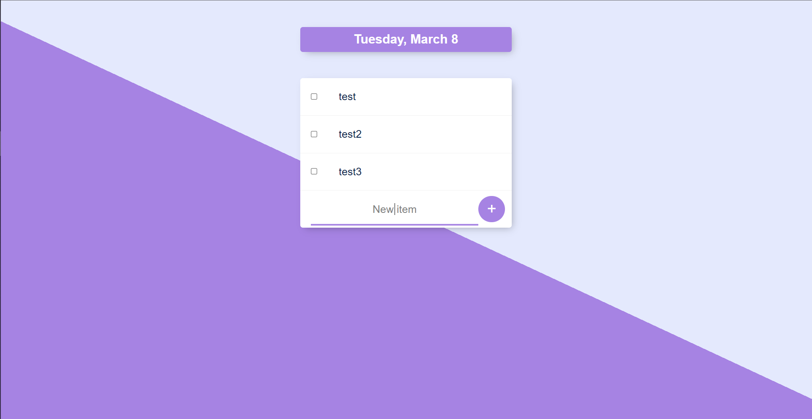
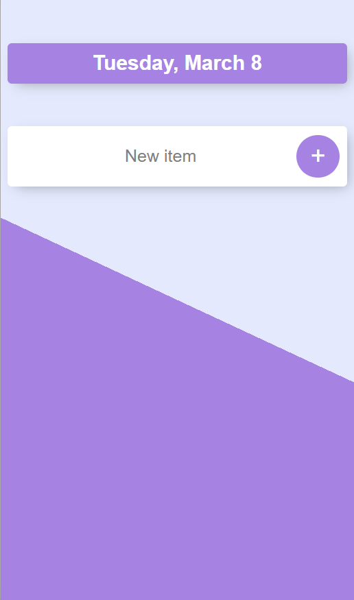

# todo-list

- A simple todo list using Node and MongoDB
  - Packages: ejs, lodash, bodyparser, express and mongoose

## Table

- [todo-list](#todo-list)
  - [Table](#table)
  - [Preview](#preview)

## Preview

-   Desktop:

    

-   Mobile:

    

